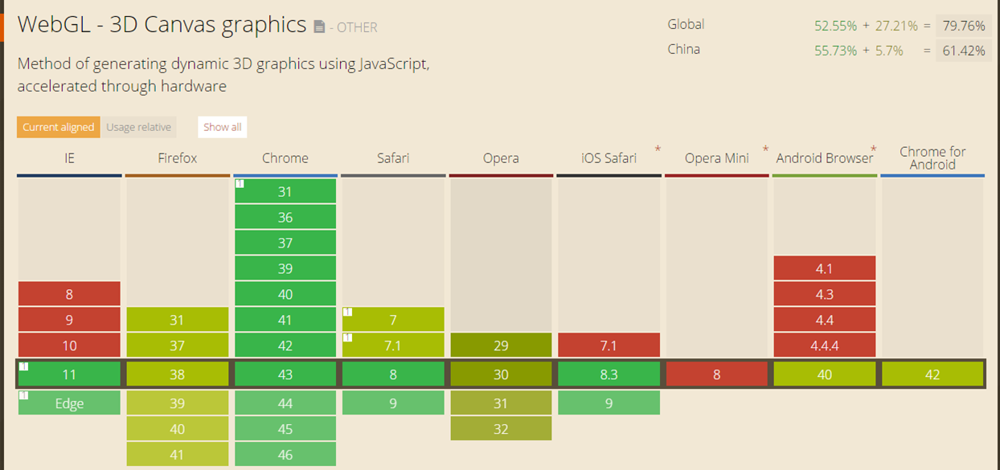

# 前端 3d 技术调研

## 现存方案

得益于前端生态的百花齐放，对于同一个问题可能存在很多种解决方案，抛开那些重复的轮子以外，剩下的方案既然能够存在下去就说明它们有存在的理由，必然都有各自的优缺点，也都有各自最适合使用的场景

      echarts、three.js、antdv、d3、chart.js、cesuim、Babylon、Unity 3D

## 原理

以上 3d 技术框架大致原理分为两类 分别是以 echarts 为代表的是 svg/canvas 双引擎设计构建页面。以 three.js\cesuim\Babylon 为主流的基于 webgl 构建的页面。以 Unity3D 为代表的 OpenGL。

### webgl

WebGL 产生的背景。WebGL 规范产生以前，浏览器如果想实现 3D 动画效果，只能借助一些浏览器插件，比如 Adobe 的 Flash、微软的 SilverLight 等来实现，那么，为了打破这一局限，各大知名公司联手制定了一种跨平台的 3D 开发标准，也就是 WebGL 规范。
其底层原理可以简单理解为，为 Web 开发者提供一套 3D 图形相关的 API，这些 API 能够让 Web 开发者使用 JavaScript 语言直接和显卡（GPU）进行通信。WebGL 的 GPU 部分也有对应的编程语言，简称 GLSL。我们用它来编写运行在 GPU 上的着色器程序。着色器程序需要接收 CPU（WebGL 使用 JavaScript） 传递过来的数据，然后对这些数据进行流水线处理，最终显示在屏幕上，进而实现丰富多彩的 3D 应用，比如 3D 图表，网页游戏，3D 地图，WebVR 等。
3D 模型数据从诞生到最终显示在屏幕上，可以想象一下流水线的生产过程，流水线按照既定的步骤对原料进行加工，当前步骤只对前一步骤的结果进行处理，然后将处理后的结果传递给下一步骤，最终将原材料生产成完整的产品。WebGL 的工作方式和流水线类似，也是按照流水线的方式将 3D 模型数据渲染到 2D 屏幕上的，业界把这种渲染方式称为图形管线或者渲染管线。
用于 WebGL 的本机 3D API 速度更快，并且具有更多功能，例如渲染管道，代码可访问性和更快的执行速度。

### canvas/svg

canvas 是 HTML5 新定义的标签，通过使用脚本（通常是 JavaScript）绘制图形。<canvas> 标签只是图形容器，相当于一个画布，canvas 元素本身是没有绘图能力的。所有的绘制工作必须在 JavaScript 内部完成，相当于使用画笔在画布上画画。
默认情况下，<canvas> 没有边框和内容。默认是一个 300\*150 的画布，所以我们创建了 <canvas> 之后要对其设置宽高。

绘制流程：
WebKit 为例

    1、浏览器(JavaScript) canvas API
    2、底层图形库 Skia(支持CPU/GPU绘制)
    3、根据平台是否支持(策略) 选取绘制方式。

其特点可以简单总结为

      通过 Javascript 来绘制 2D 图形
      是逐像素进行渲染的。
      一旦图形被绘制完成，它就不会被浏览器所关注，如果其位置发生改变，会重新进行绘制。

svg 是指可伸缩矢量图形 (Scalable Vector Graphics)，是基于可扩展标记语言（XML），用于描述二维矢量图形的一种图形格式。SVG 是 W3C 制定的一种新的二维矢量图形格式，也是规范中的网络矢量图形标准。SVG 严格遵从 XML 语法，并用文本格式的描述性语言来描述图像内容，因此是一种和图像分辨率无关的矢量图形格式。不适合游戏应用。

### 原理特点对比

canvas:

    依赖分辨率
    不支持事件处理器
    弱的文本渲染能力
    能够以 .png 或 .jpg 格式保存结果图像
    最适合图像密集型的游戏，其中的许多对象会被频繁重绘

webgl:

    用于 WebGL 的本机 3D API 速度更快，并且具有更多功能，例如渲染管道，代码可访问性和更快的执行速度。
    它通过HTML脚本本身实现Web交互式三维动画的制作，无需任何浏览器插件支持。
    它利用底层的图形硬件加速功能进行的图形渲染，是通过统一的、标准的、跨平台的OpenGL接口实现的。

结论：对于构建大型 3d 项目无疑应当选择 webgl 为原理的框架,其缺点为，尽管从功能上而言原生 WebGL API 可以满足我们任意场景的开发需要但是，其开发和学习的成本极其昂贵。对于 WebGL 的初学者而言是极度不友好的，我们需要配置顶点着色器用于计算绘制顶点所在的位置，而这对于开发者而言需要一定的数学基础熟悉矩阵的运算，同时也要有空间几何的概念熟悉 3D 物体的空间分布。而场景的光照，纹理等的设计也都需要对颜色的配置有自己的见解

### 兼容性

Webkit 浏览器基本都是支持的，IE 直到 11 才开始支持

## 框架对比

cesuim、Babylon、three.js

Three.js

Three.js 是 WebGL 的综合库，其应用范围比较广泛、开发应用，做了一定的渲染细节封装。美中不足的一点是，Three.js 库没有比较全面详细的官方文档，对于使用者而言不是特别友好

cesium

cesuim 是专用于 3D 地图开发的 WebGL 库，其拥有较为全面的 3D 地图开发 API，对于需要开发 3D 地图的开发者而言是一个不错的选择，但针对其他场景的应用开发覆盖的就不是很全面了

Babylon.js

Babylon.js 是一款国外应用较广泛的 WebGL 库。

### 三个框架的活跃度

github star 数、代码更新频率、issue 响应速度、文档完整度、在线示例、官方团队和社区的规模等方面进行判断，排除 Babylon.js 一个低于 1k star、超过半年没有更新、issue 很少或者响应速度很慢，低于 3 个 contributor、文档只有几段话的项目一般而言是无法用于线上环境的

剩余两个框架由业内知名公司开源，有专门团队维护、有专门的社区、几乎每天都有 commit，显然是可选方案

总结：
从成本、生态、开发难度、性能、可扩展度 、定位总结以上三个框架

      Babylon.js 相对属于新技术，资料较少，社区不完备。(github 15k)
      cesuim 足够成熟，但不确定细节实现,上手难度较高。(github 7.6k)
      three.js 提供了更高层的渲染接口，有对相机、视口的控制，能够兼容多种文件格式，可轻松支撑楼层房间级别渲染。
      从工作量、学习/维护成本、对于业务的侵入度、生产环境可用性等多方面进行考虑更适合。（github 75K

#### 参考

http://www.webgl3d.cn/links/web.html

http://www.webgl3d.cn/WebGL/

https://cesium.com/platform/cesiumjs/
